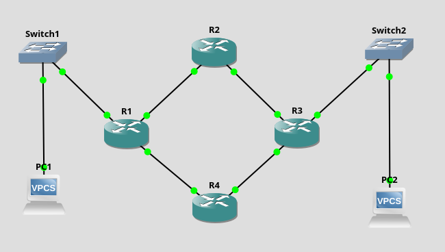
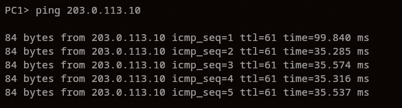
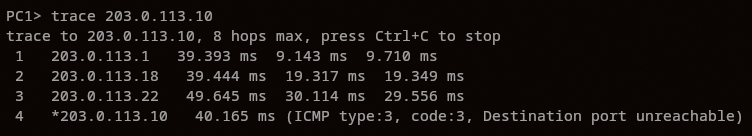
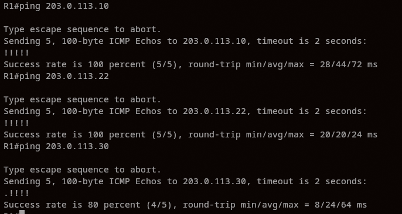
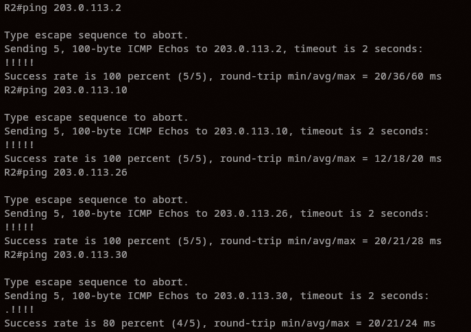
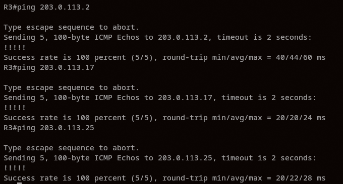
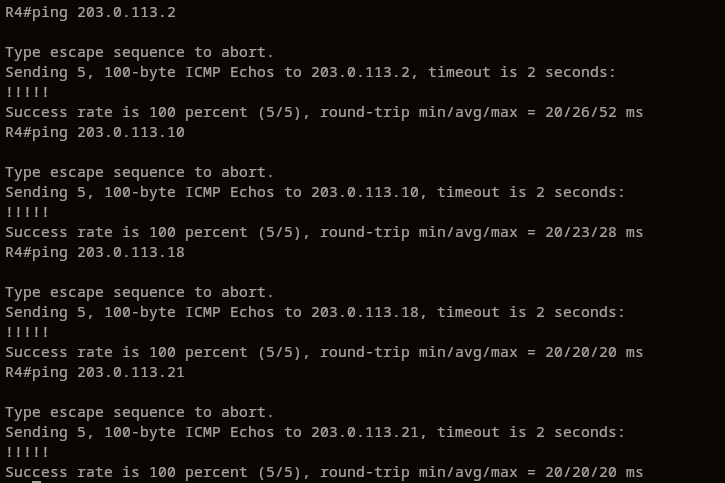

# Relatório — Configurando Subredes com IPv4 e Roteamento Estático

**Disciplina:** Laboratório de Redes de Computadores — PUCRS
**Integrantes:** Guilherme Hoffmann, João Sbardelotto
**Data:** 15/06/2026

---

## 1. Objetivo

Criar e configurar uma rede local no simulador GNS3, exercitando o endereçamento
IPv4 com subredes (VLSM) e o roteamento estático entre 4 roteadores, validando a
conectividade total com `ping`.

## 2. Topologia

```
PC1 — Switch1 — R1 — R2 — R3 — Switch2 — PC2
                 \         /
                  R4 ------
```



## 3. Projeto de endereçamento

Foi utilizado **um único endereço público**, a rede **203.0.113.0/24**, subdividida
com **VLSM** (máscaras de tamanho variável) para usar a máscara mais adequada a cada
segmento.

| Subrede | Rede/Máscara   | Hosts úteis | Uso              |
| ------- | --------------- | ------------ | ---------------- |
| LAN1    | 203.0.113.0/29  | .1–.6       | PC1, Switch1, R1 |
| LAN2    | 203.0.113.8/29  | .9–.14      | PC2, Switch2, R3 |
| R1↔R2  | 203.0.113.16/30 | .17–.18     | enlace           |
| R2↔R3  | 203.0.113.20/30 | .21–.22     | enlace           |
| R1↔R4  | 203.0.113.24/30 | .25–.26     | enlace           |
| R3↔R4  | 203.0.113.28/30 | .29–.30     | enlace           |

**Justificativa das máscaras:**

- Os 4 enlaces entre roteadores são ponto-a-ponto (só 2 hosts), logo usam **/30**
  (2 endereços úteis), evitando desperdício de endereços.
- As 2 LANs usam **/29** (6 hosts úteis), suficiente para os PCs e folga futura.

**Endereços por interface:**

- **R1:** f0/0 .1 (LAN1) | f0/1 .17 (R2) | f1/0 .25 (R4)
- **R2:** f0/0 .18 (R1) | f0/1 .21 (R3)
- **R3:** f0/0 .22 (R2) | f0/1 .29 (R4) | f1/0 .9 (LAN2)
- **R4:** f0/0 .26 (R1) | f0/1 .30 (R3)
- **PC1:** .2  (gw .1)   |   **PC2:** .10  (gw .9)

## 4. Roteamento estático

Como nem todas as subredes são diretamente conectadas a cada roteador, foram
adicionadas rotas estáticas (`ip route`) para garantir conectividade total entre as
6 subredes. O tráfego PC1↔PC2 segue o caminho R1→R2→R3; o R4 fornece caminho
alternativo no triângulo R1–R4–R3.

Saída de `show ip route` em cada roteador (rotas conectadas `C` + estáticas `S`):

**R1**


**R2**


**R3**


**R4**


## 5. Configuração das interfaces

Saída de `show ip interface brief` em cada roteador (todas as interfaces em `up/up`
com os IPs do projeto de endereçamento). Os scripts completos usados estão em
R1.txt, R2.txt, R3.txt, R4.txt e PCs-VPCS.txt.

**R1**


**R2**


**R3**


**R4**


## 6. Validação / Monitoramento (pings)

Testes realizados e resultados:

| Origem | Destino                          | Resultado        |
| ------ | -------------------------------- | ---------------- |
| PC1    | PC2 (203.0.113.10)               | OK (5/5)         |
| R1     | PC2 / LAN2 (.10)                 | OK (100%)        |
| R1     | enlace R2-R3 (.22)               | OK (100%)        |
| R1     | enlace R3-R4 (.30)               | OK (80%)*        |
| R2     | PC1 (.2), PC2 (.10)              | OK (100%)        |
| R2     | enlaces R1-R4 (.26), R3-R4 (.30) | OK (100% / 80%*) |
| R3     | PC1 (.2)                         | OK (100%)        |
| R3     | enlaces R1-R2 (.17), R1-R4 (.25) | OK (100%)        |
| R4     | PC1 (.2), PC2 (.10)              | OK (100%)        |
| R4     | enlaces R1-R2 (.18), R2-R3 (.21) | OK (100%)        |

\* Os pings para 203.0.113.30 resultam em 80% (4/5) por perda **apenas do primeiro
pacote**, comportamento normal do Cisco IOS durante a resolução ARP do próximo salto;
os demais pacotes obtêm 100% de sucesso. Não indica falha de roteamento.

**PC1 → PC2** (atravessa toda a rede, ttl=61):



**Traceroute PC1 → PC2** — confirma o caminho R1(.1) → R2(.18) → R3(.22) → PC2(.10):



**Pings a partir dos roteadores:**

**R1**


**R2**


**R3**


**R4**


## 7. Conclusão

A rede foi configurada com sucesso usando um único bloco público subdividido por
VLSM e roteamento estático nos 4 roteadores. Os testes de `ping` confirmaram
conectividade total entre as 6 subredes (PCs e enlaces), atendendo a todos os
requisitos do exercício.
